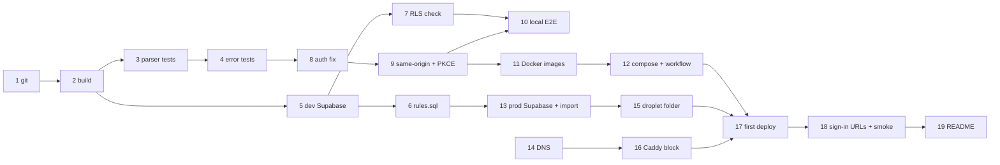

# CMM Internship Tracker — Verify, Test & Launch Implementation Plan

> **For agentic workers:** REQUIRED SUB-SKILL: Use superpowers:subagent-driven-development (recommended) or superpowers:executing-plans to implement this plan task-by-task. Steps use checkbox (`- [ ]`) syntax for tracking.

**Goal:** Take the already-written CMM Internship Tracker (see `README.md`) from "code that has never run" to a version-controlled, tested app live at **https://cmm27.cmm.works** on the shared CMM droplet.

**Architecture:** No re-architecture of the app. The code in `supabase/`, `server/` and `client/` already implements the README. This plan adds tests that pin the business rules, fixes six defects, and deploys using `DEPLOYMENT_GUIDE.md`. The deployment is two containers, `cmm27-web` (nginx serving the Vite build) and `cmm27-api` (Express), in `/opt/cmm27` on the droplet, joined to the shared `cmm_default` network. The CMM Hub's Caddy routes `cmm27.cmm.works/api/*` to the API and everything else to the web container. GitHub Actions builds both images to GHCR on each push to `main` and restarts them over SSH. Tests are *characterization tests*: they are expected to PASS against existing code. A failing test means a real bug, so stop and use superpowers:systematic-debugging.

**Tech Stack:** Supabase (Postgres 15 + Google Auth) · Node ≥ 20.6 + Express 4 · React 18 + Vite 5 + Tailwind v4 · `node:test` · Docker + nginx · Caddy (shared) · GitHub Actions + GHCR · DigitalOcean droplet `139.59.100.44`

---

## Progress overview

**How to track:** when a task starts, set its Status to 🟨. When every checkbox in the task is ticked, set it to ✅. Use ⛔ plus a note when a task is waiting on someone. Commit this file with the work so the history shows progress.

Legend: ⬜ not started · 🟨 in progress · ✅ done · ⛔ blocked
Owner: **Claude** = can be done by the agent · **You** = needs your accounts or a browser sign-in · **Maintainer** = whoever runs the droplet, DNS and the CMM Hub server repo

| # | Phase | Task | Owner | Needs | Status |
|---|---|---|---|---|---|
| 1 | A. Foundation | Put the project under git | Claude | — | ✅ |
| 2 | A. Foundation | Install dependencies; prove both apps build | Claude | 1 | 🟨 server ✅, client build waits for mockups |
| 3 | B. Tests | Test harness + CSV parser tests | Claude | 2 | ✅ |
| 4 | B. Tests | DB-error → HTTP mapping tests | Claude | 3 | ✅ |
| 5 | C. Database | Create **dev** Supabase project, apply schema | You | 2 | ⬜ |
| 6 | C. Database | SQL test script for every business rule | Claude + You | 5 | ⬜ |
| 7 | C. Database | Verify browser keys can't touch data | Claude | 5 | ⬜ |
| 8 | D. Fixes | D1: don't auto-link rejected sign-ins | Claude | 4 | ✅ (live check in Task 10) |
| 9 | D. Fixes | D4–D6: same-origin `/api`, PKCE, `/api/health` | Claude | 8 | 🟨 server ✅ (`/api/health`), client parts wait for mockups |
| 10 | E. Local run | Google sign-in + local end-to-end smoke test | You | 7, 9 | ⬜ |
| 11 | F. Containers | Dockerfiles + nginx (D2, D3); test images locally | Claude | 9 | ⛔ server Dockerfile written; needs Docker Desktop running to test |
| 12 | F. Containers | Droplet compose file + CI/deploy workflow | Claude | 11 | ⬜ |
| 13 | G. Go-live | Create **prod** Supabase project; import the form CSV | You | 6 | ⬜ |
| 14 | G. Go-live | DNS: `cmm27.cmm.works` → droplet | Maintainer | — | ⬜ |
| 15 | G. Go-live | Droplet folder `/opt/cmm27` + `.env` | You (deploy key) | 13 | ⬜ |
| 16 | G. Go-live | Caddy site block (PR to CMM Hub server repo) | Maintainer | 14 | ⬜ |
| 17 | G. Go-live | GitHub repo, secrets, first deploy | You | 12, 15, 16 | ⬜ |
| 18 | G. Go-live | Sign-in URLs + production smoke test | You | 17 | ⬜ |
| 19 | H. Docs | Update README | Claude | 18 | ⬜ |

**Milestones**

| Milestone | Reached when | Status |
|---|---|---|
| M1 Rules proven | Tasks 1–7 ✅: unit tests green, `rules.sql` passes, RLS verified | ⬜ |
| M2 Runs locally | Tasks 8–12 ✅: fixes merged, full flow works locally, images run | ⬜ |
| M3 Live | Tasks 13–19 ✅: cohort imported, `https://cmm27.cmm.works` signed in and smoke-tested | ⬜ |



Phases A–F do not depend on the Maintainer. Ask them for **Tasks 14 and 16 and the droplet deploy key** at the start, so those are ready by the time Task 12 is done.

---

## Deployment values (from `DEPLOYMENT_GUIDE.md` §2)

| Placeholder in guide | This project |
|---|---|
| `<APP_DOMAIN>` | `cmm27.cmm.works` |
| `<PROJECT>` | `cmm27` (folder `/opt/cmm27`, services `cmm27-web`, `cmm27-api`) |
| `<ORG>` | Your personal GitHub username, lowercased. It is **never hard-coded**: the workflow lowercases `github.repository_owner`, and the droplet reads `GHCR_OWNER` from `/opt/cmm27/.env` |
| `<IMAGE>` | `cmm27-web`, `cmm27-api` |
| `<PORT>` | `80` (web), `4000` (api) |
| `<HEALTH_PATH>` | `/api/health` |

## Defects found during code review (fixed in this plan)

| # | Where | Problem | Task |
|---|---|---|---|
| D1 | `server/src/middleware/auth.js:38-48` | Auto-link by email runs **before** the domain check. A non-KMUTT Google account whose email matches a STUDENT row gets `auth_user_id` written, then a 403, and the real student can never link (`ALREADY_CLAIMED`). | 8 |
| D2 | `server/package.json` `start` | `node --env-file=.env` exits when `.env` is missing, which it always is in a container. | 11 (Dockerfile runs `node src/index.js`) |
| D3 | `client/` | `BrowserRouter` with no SPA fallback, so a refresh on `/companies` returns 404 in production. | 11 (`nginx.conf` `try_files`) |
| D4 | `client/src/lib/api.js:3` | Bakes `VITE_API_URL` (a hostname) into the build. Guide §10: this broke CMM after a domain change. | 9 (relative `/api`, Vite proxy in dev) |
| D5 | `client/src/lib/supabase.js` | Implicit OAuth flow. Guide §10: Google sign-in lands on `/#`. | 9 (`flowType: 'pkce'`) |
| D6 | `server/src/index.js:21` | Health check is `/health`, but Caddy only sends `/api/*` to the API container, so the deploy smoke check can't reach it. | 9 (add `/api/health`) |

## File map

| File | Action | Responsibility |
|---|---|---|
| `.gitignore` | Create | Keep secrets, student data and build output out of git |
| `server/package.json` | Modify | Add `test` script |
| `server/test/parse-form.test.js` | Create | CSV parser tests |
| `server/test/errors.test.js` | Create | DB-error → HTTP mapping tests |
| `supabase/tests/rules.sql` | Create | Self-checking SQL proof of every README rule; rolls back |
| `server/src/middleware/auth.js` | Modify | D1 |
| `server/src/index.js` | Modify | D6 |
| `client/src/lib/api.js` | Modify | D4 |
| `client/vite.config.js` | Modify | D4 (dev proxy) |
| `client/.env.example` | Modify | D4 (drop `VITE_API_URL`) |
| `client/src/lib/supabase.js` | Modify | D5 |
| `server/Dockerfile`, `server/.dockerignore` | Create | API image (D2) |
| `client/Dockerfile`, `client/nginx.conf`, `client/.dockerignore` | Create | Web image, caching, SPA fallback (D3) |
| `infra/docker-compose.yml` | Create | What runs in `/opt/cmm27` |
| `.github/workflows/deploy.yml` | Create | Test on every push/PR; build, push, deploy, smoke-check on `main` |
| `README.md` | Modify | Testing + deployment docs |

Outside this repo (Maintainer): DNS record at GoDaddy, and the `infra/caddy/Caddyfile` block in the CMM Hub server repo.

---

### Task 1: Put the project under git

**Files:**
- Create: `.gitignore`

- [x] **Step 1: Create `.gitignore` at the repo root**

```gitignore
node_modules/
.env
.env.local
dist/
# Student data — never commit
*.csv
import-report.json
# Secrets / local tooling
cmm_deploy_key*
graft/.cache/
.DS_Store
```

- [x] **Step 2: Initialise and make the first commit**

```bash
cd "C:/Users/krittin pragopdee/OneDrive/Desktop/University/CMM27-Internship"
git init -b main
git add .
git status   # confirm: no .env, node_modules, .csv or deploy key listed
git commit -m "chore: initial import of CMM internship tracker"
```

Expected: commit succeeds; `git status` is clean afterwards.

> OneDrive note: if OneDrive locks files during `npm install`, pause syncing for this folder while you work.

---

### Task 2: Install dependencies and prove both apps build

**Files:** none changed.

- [x] **Step 1: Check Node version**

Run: `node --version`
Expected: `v20.6.0` or newer (this machine has v26.1.0 ✔).

- [x] **Step 2: Install server deps and syntax-check every file**

```bash
cd server
npm ci
for f in src/index.js src/lib/*.js src/middleware/*.js src/routes/*.js scripts/*.js; do node --check "$f" || echo "FAIL $f"; done
```

Expected: no `FAIL` lines.

- [ ] **Step 3: Install client deps and build**

```bash
cd ../client
npm ci
npm run build
```

Expected: `✓ built in …`; `client/dist/index.html` exists. No env vars are needed to build.

- [x] **Step 4: Commit lockfile changes, if any**

```bash
cd ..
git add server/package-lock.json client/package-lock.json
git commit -m "chore: refresh lockfiles" || echo "nothing to commit"
```

---

### Task 3: Test harness + CSV parser tests

The parser (`server/scripts/parse-form.js`) decides every student's starting state. It is pure (no DB).

**Files:**
- Modify: `server/package.json` (scripts)
- Create: `server/test/parse-form.test.js`

- [x] **Step 1: Add the `test` script to `server/package.json`**

```json
  "scripts": {
    "dev": "node --watch --env-file=.env src/index.js",
    "start": "node --env-file=.env src/index.js",
    "import": "node --env-file=.env scripts/import-students.js",
    "test": "node --test"
  },
```

- [x] **Step 2: Write `server/test/parse-form.test.js`**

```js
import { test } from 'node:test';
import assert from 'node:assert/strict';
import { parseFormCsv } from '../scripts/parse-form.js';

const HEADERS = [
  'Timestamp',
  'รหัสนักศึกษา (เช่น 67080500200)',
  'เริ่มเตรียมตัวฝึกงานหรือยัง',
  'สถานะการเตรียมตัว ณ ปัจจุบัน',
];

const q = (v) => `"${String(v).replaceAll('"', '""')}"`;
const csv = (headers, rows) => [headers, ...rows].map((r) => r.map(q).join(',')).join('\n');
const form = (...rows) => csv(HEADERS, rows.map((r) => ['2026/09/01 10:00', ...r]));

test('maps checklist items to resume / portfolio / submitted', () => {
  const out = parseFormCsv(
    form(['67080500201', 'เริ่มแล้ว', 'ทำ Resume แล้ว, ทำ Portfolio แล้ว, ยื่นแล้ว'])
  );
  assert.deepEqual(out.rows, [
    { student_id: '67080500201', resume: true, portfolio: true, submitted: true, full_name: null, email: null },
  ]);
  assert.equal(out.totalRecords, 1);
  assert.deepEqual(out.problems, []);
});

test('ignores หาข้อมูลที่ฝึกงานแล้ว', () => {
  const out = parseFormCsv(form(['67080500202', 'เริ่มแล้ว', 'หาข้อมูลที่ฝึกงานแล้ว']));
  assert.equal(out.rows[0].resume, false);
  assert.equal(out.rows[0].portfolio, false);
  assert.equal(out.rows[0].submitted, false);
});

test('strips non-digits from the student ID', () => {
  const out = parseFormCsv(form(['6708-0500-203', 'เริ่มแล้ว', '']));
  assert.equal(out.rows[0].student_id, '67080500203');
});

test('skips Excel scientific-notation IDs with a clear message', () => {
  const out = parseFormCsv(form(['6.70805E+10', 'เริ่มแล้ว', 'ทำ Resume แล้ว']));
  assert.equal(out.rows.length, 0);
  assert.equal(out.problems.length, 1);
  assert.equal(out.problems[0].line, 2);
  assert.match(out.problems[0].issue, /scientific notation/);
});

test('skips IDs that are not 11 digits', () => {
  const out = parseFormCsv(form(['12345', 'เริ่มแล้ว', '']));
  assert.equal(out.rows.length, 0);
  assert.match(out.problems[0].issue, /11 digits/);
});

test('combines duplicate responses forward-only', () => {
  const out = parseFormCsv(
    form(
      ['67080500204', 'เริ่มแล้ว', 'ทำ Resume แล้ว'],
      ['67080500204', 'เริ่มแล้ว', 'ทำ Portfolio แล้ว']
    )
  );
  assert.equal(out.rows.length, 1);
  assert.equal(out.rows[0].resume, true);
  assert.equal(out.rows[0].portfolio, true);
  assert.ok(out.notes.some((n) => n.line === 3 && /Duplicate response/.test(n.note)));
});

test('flags ยื่นแล้ว without both documents but keeps the flag for the DB to judge', () => {
  const out = parseFormCsv(form(['67080500205', 'เริ่มแล้ว', 'ทำ Resume แล้ว, ยื่นแล้ว']));
  assert.equal(out.rows[0].submitted, true);
  assert.ok(out.notes.some((n) => /stay at preparation stage/.test(n.note)));
});

test('notes when "not started" conflicts with ticked items', () => {
  const out = parseFormCsv(form(['67080500206', 'ยังไม่เริ่ม', 'ทำ Resume แล้ว']));
  assert.equal(out.rows[0].resume, true);
  assert.ok(out.notes.some((n) => /ยังไม่เตรียมตัว/.test(n.note)));
});

test('keeps only student-domain emails, lowercased', () => {
  const headers = [...HEADERS, 'Email Address'];
  const out = parseFormCsv(
    csv(headers, [
      ['t', '67080500207', 'เริ่มแล้ว', '', 'S.One@MAIL.KMUTT.AC.TH'],
      ['t', '67080500208', 'เริ่มแล้ว', '', 'someone@gmail.com'],
    ])
  );
  assert.equal(out.rows[0].email, 's.one@mail.kmutt.ac.th');
  assert.equal(out.rows[1].email, null);
});

test('throws when required columns are missing', () => {
  assert.throws(() => parseFormCsv('a,b\n1,2'), /Could not find the required columns/);
});
```

- [x] **Step 3: Run the tests**

Run: `cd server && npm test`
Expected: `# pass 10`, `# fail 0`. If a test fails, do **not** edit it to match. The README's import table is the spec, so use superpowers:systematic-debugging to decide which side is wrong.

- [x] **Step 4: Commit**

```bash
git add server/package.json server/test/parse-form.test.js
git commit -m "test: pin Google Form CSV parsing rules"
```

---

### Task 4: DB-error → HTTP mapping tests

`fromDbError` turns `PREREQ_NOT_MET: …` raised in SQL into the 422 the client shows. `server/src/lib/errors.js` has no imports, so no Supabase is needed.

**Files:**
- Create: `server/test/errors.test.js`

- [x] **Step 1: Write the test**

```js
import { test } from 'node:test';
import assert from 'node:assert/strict';
import { fromDbError, HttpError } from '../src/lib/errors.js';

const cases = [
  [{ message: 'PREREQ_NOT_MET: both Resume and Portfolio must be complete' }, 422, 'PREREQ_NOT_MET', 'both Resume and Portfolio must be complete'],
  [{ message: 'COMPANY_REQUIRED: choose a company' }, 422, 'COMPANY_REQUIRED'],
  [{ message: 'INVALID_TRANSITION: submit first' }, 409, 'INVALID_TRANSITION'],
  [{ message: 'ALREADY_DONE: done' }, 409, 'ALREADY_DONE'],
  [{ message: 'FORWARD_ONLY: no going back' }, 409, 'FORWARD_ONLY'],
  [{ message: 'COMPANY_NOT_FOUND: missing' }, 404, 'COMPANY_NOT_FOUND'],
  [{ message: 'IMMUTABLE_LOG: nope' }, 409, 'IMMUTABLE_LOG'],
  [{ message: 'dup', code: '23505' }, 409, 'DUPLICATE'],
  [{ message: 'fk', code: '23503' }, 409, 'IN_USE'],
  [{ message: 'check', code: '23514' }, 422, 'CONSTRAINT_VIOLATION'],
  [{ message: 'bad uuid', code: '22P02' }, 400, 'INVALID_INPUT'],
  [{ message: 'boom', code: 'XX000' }, 500, 'DB_ERROR'],
  // An unknown "PREFIX:" must not be treated as a domain code.
  [{ message: 'SOMETHING_ELSE: x', code: '23514' }, 422, 'CONSTRAINT_VIOLATION'],
];

for (const [input, status, code, message] of cases) {
  test(`${input.code ?? ''} ${input.message} -> ${status} ${code}`, () => {
    const err = fromDbError(input);
    assert.ok(err instanceof HttpError);
    assert.equal(err.status, status);
    assert.equal(err.code, code);
    if (message) assert.equal(err.message, message);
  });
}
```

- [x] **Step 2: Run**

Run: `cd server && npm test`
Expected: `# fail 0` (23 tests total).

- [x] **Step 3: Commit**

```bash
git add server/test/errors.test.js
git commit -m "test: pin DB error to HTTP status mapping"
```

---

### Task 5: Create the **dev** Supabase project and apply the schema (manual)

**Why two projects:** the timeline log is immutable and references `users` with `on delete restrict`, so a student row can never be deleted once created. Tasks 5–10 create test students, so they must live in a throwaway **dev** project. The **prod** project is created in Task 13. The free tier allows two projects.

**Files:** none.

- [ ] **Step 1:** Create a project named `cmm27-dev` at supabase.com, in the Singapore region (`ap-southeast-1`). Save the DB password in a password manager.
- [ ] **Step 2:** SQL Editor → paste all of `supabase/migrations/001_schema.sql` → Run. Expected: `Success. No rows returned`.
- [ ] **Step 3:** Verify the seed data: `select count(*) from public.business_types;` → `12`.
- [ ] **Step 4:** Collect keys from **Project Settings → API Keys**. If the dashboard shows *Publishable* / *Secret* keys rather than *anon* / *service_role*, use the publishable key for `VITE_SUPABASE_ANON_KEY` and the secret key for `SUPABASE_SERVICE_ROLE_KEY`.
- [ ] **Step 5:** Create the env files (both are git-ignored):

```bash
cp server/.env.example server/.env   # fill SUPABASE_URL, SUPABASE_SERVICE_ROLE_KEY (dev)
cp client/.env.example client/.env   # fill VITE_SUPABASE_URL, VITE_SUPABASE_ANON_KEY (dev)
```

- [ ] **Step 6:** `cd server && npm run dev`, then `curl http://localhost:4000/health` → `{"ok":true}`, and `curl http://localhost:4000/api/auth/me` → 401 `UNAUTHENTICATED`.

---

### Task 6: SQL test script for every business rule

This script proves each row of the README's "How the rules are enforced" table directly in Postgres. It runs in one transaction and is **rolled back**, so it is safe on any project. Any failure raises an exception.

**Files:**
- Create: `supabase/tests/rules.sql`

- [ ] **Step 1: Write the script**

```sql
-- Business-rule tests. Self-checking; everything is rolled back.
-- Run: psql "$SUPABASE_DB_URL" -v ON_ERROR_STOP=1 -f supabase/tests/rules.sql
--  or paste into the Supabase SQL Editor (success = no error).
begin;

create function pg_temp.expect_error(p_sql text, p_expected text)
returns void language plpgsql as $$
begin
  execute p_sql;
  raise exception 'TEST FAILED: expected % from: %', p_expected, p_sql;
exception when others then
  if sqlerrm like 'TEST FAILED%' then raise; end if;
  if position(p_expected in sqlerrm) = 0 and sqlstate <> p_expected then
    raise exception 'TEST FAILED: expected %, got [%] % from: %', p_expected, sqlstate, sqlerrm, p_sql;
  end if;
end $$;

insert into public.users (role, full_name, email) values ('ADVISOR', 'Test Advisor', 'test.advisor@example.com');
insert into public.users (student_id, full_name) values ('99999999901', 'Test A'), ('99999999902', 'Test B');

do $$
declare
  adv uuid := (select id from public.users where email = 'test.advisor@example.com');
  a   uuid := (select id from public.users where student_id = '99999999901');
  b   uuid := (select id from public.users where student_id = '99999999902');
  c   uuid;
  c2  uuid;
  u   public.users;
  n   int;
  evs text[];
  r   jsonb;
  m   jsonb;
begin
  insert into public.companies (name, business_type_id, url, work_mode, source_type, created_by)
  values ('__Test Co__', 1, 'https://example.com', 'ONSITE', 'CLASSMATE', a) returning id into c;
  insert into public.companies (name, business_type_id, url, work_mode, source_type, created_by)
  values ('__Test Co 2__', 2, 'https://example.org', 'HYBRID', 'SENIOR', a) returning id into c2;

  -- Data validation
  perform pg_temp.expect_error($q$insert into public.users (student_id) values ('123')$q$, '23514');
  perform pg_temp.expect_error(
    format($q$insert into public.companies (name, business_type_id, url, work_mode, source_type, created_by)
              values (' __test co__ ', 1, 'https://x.com', 'ONSITE', 'CLASSMATE', %L)$q$, a), '23505');
  perform pg_temp.expect_error(format('select public.student_apply_action(%L, %L)', adv, 'COMPLETE_RESUME'), 'NOT_A_STUDENT');

  -- Every new student is logged
  select count(*) into n from public.status_timeline_logs where user_id = a and event = 'INITIALIZED';
  assert n = 1, 'insert should log INITIALIZED';

  -- Resume and Portfolio in any order (Portfolio first here)
  u := public.student_apply_action(a, 'COMPLETE_PORTFOLIO');
  assert u.current_status = 'PORTFOLIO_DONE' and u.is_portfolio_ready, 'portfolio first';
  u := public.student_apply_action(a, 'COMPLETE_RESUME');
  assert u.current_status = 'RESUME_DONE' and u.is_resume_ready and u.is_portfolio_ready, 'then resume';
  perform pg_temp.expect_error(format('select public.student_apply_action(%L, %L)', a, 'COMPLETE_RESUME'), 'ALREADY_DONE');

  -- ยื่นแล้ว requires both docs: function AND check constraint
  perform pg_temp.expect_error(format('select public.student_apply_action(%L, %L)', b, 'SUBMIT'), 'PREREQ_NOT_MET');
  perform pg_temp.expect_error(
    format($q$update public.users set current_status = 'APPLICATIONS_SUBMITTED' where id = %L$q$, b), '23514');

  -- ยืนยันที่ฝึกงาน requires submit first, then a real catalog company
  perform pg_temp.expect_error(format('select public.student_apply_action(%L, %L, %L)', a, 'CONFIRM', c), 'INVALID_TRANSITION');
  u := public.student_apply_action(a, 'SUBMIT');
  assert u.current_status = 'APPLICATIONS_SUBMITTED', 'submit';
  perform pg_temp.expect_error(format('select public.student_apply_action(%L, %L)', a, 'CONFIRM'), 'COMPANY_REQUIRED');
  perform pg_temp.expect_error(
    format('select public.student_apply_action(%L, %L, %L)', a, 'CONFIRM', gen_random_uuid()), 'COMPANY_NOT_FOUND');
  u := public.student_apply_action(a, 'CONFIRM', c);
  assert u.current_status = 'INTERNSHIP_CONFIRMED' and u.confirmed_company_id = c, 'confirm';

  -- Check constraint: confirmed <=> company (bypassing the function)
  perform public.student_apply_action(b, 'COMPLETE_RESUME');
  perform public.student_apply_action(b, 'COMPLETE_PORTFOLIO');
  perform public.student_apply_action(b, 'SUBMIT');
  perform pg_temp.expect_error(
    format($q$update public.users set current_status = 'INTERNSHIP_CONFIRMED' where id = %L$q$, b), '23514');

  -- Forward-only trigger
  perform pg_temp.expect_error(format('update public.users set is_resume_ready = false where id = %L', a), 'FORWARD_ONLY');
  perform pg_temp.expect_error(
    format($q$update public.users set current_status = 'APPLICATIONS_SUBMITTED', confirmed_company_id = null where id = %L$q$, a), 'FORWARD_ONLY');
  perform pg_temp.expect_error(format('update public.users set confirmed_company_id = %L where id = %L', c2, a), 'FORWARD_ONLY');

  -- Timeline written automatically, in order, with the company on confirm
  select array_agg(event::text order by changed_at, id) into evs from public.status_timeline_logs where user_id = a;
  assert evs = array['INITIALIZED','PORTFOLIO_COMPLETED','RESUME_COMPLETED','APPLICATIONS_SUBMITTED','INTERNSHIP_CONFIRMED'],
    format('timeline order, got %s', evs);
  assert (select company_id from public.status_timeline_logs where user_id = a and event = 'INTERNSHIP_CONFIRMED') = c,
    'confirm log carries company';

  -- Log is immutable
  perform pg_temp.expect_error(format('update public.status_timeline_logs set note = %L where user_id = %L', 'x', a), 'IMMUTABLE_LOG');
  perform pg_temp.expect_error(format('delete from public.status_timeline_logs where user_id = %L', a), 'IMMUTABLE_LOG');
  perform pg_temp.expect_error('truncate public.status_timeline_logs', 'IMMUTABLE_LOG');

  -- Confirmed company cannot be deleted
  perform pg_temp.expect_error(format('delete from public.companies where id = %L', c), '23503');

  -- Import: forward-only, idempotent, refuses submit without both docs
  r := public.import_students('[{"student_id":"99999999903","resume":true,"portfolio":false,"submitted":true}]');
  assert (r->0->>'created')::boolean, 'import creates';
  assert r->0->>'status' = 'RESUME_DONE', format('import keeps prep stage, got %s', r->0->>'status');
  assert jsonb_array_length(r->0->'warnings') = 1, 'import warns on submit without docs';
  r := public.import_students('[{"student_id":"99999999903","resume":true,"portfolio":true,"submitted":true}]');
  assert not (r->0->>'created')::boolean and r->0->>'status' = 'APPLICATIONS_SUBMITTED', 'import moves forward';
  r := public.import_students('[{"student_id":"99999999903","resume":false,"portfolio":false,"submitted":false}]');
  assert r->0->>'status' = 'APPLICATIONS_SUBMITTED', 'import never moves back';
  assert (select note from public.status_timeline_logs
          where user_id = (select id from public.users where student_id = '99999999903')
          order by id limit 1) = 'นำเข้าจากแบบฟอร์ม', 'import note on timeline';

  -- Metrics shape
  m := public.get_cohort_metrics();
  assert (select count(*) from jsonb_object_keys(m->'by_status')) = 5, 'metrics has 5 statuses';
  assert (m->>'total')::int >= 3, 'metrics counts students';

  raise notice 'ALL RULE TESTS PASSED';
end $$;

rollback;
```

- [ ] **Step 2: Run it against the dev project** (connection string from **Project Settings → Database → Connection string → URI**, session pooler)

```bash
psql "postgresql://postgres.<dev-ref>:<password>@aws-0-ap-southeast-1.pooler.supabase.com:5432/postgres" \
  -v ON_ERROR_STOP=1 -f supabase/tests/rules.sql
```

Expected: `NOTICE:  ALL RULE TESTS PASSED`, then `ROLLBACK`. Without psql, paste the script into the SQL Editor; the expected result is no error.

- [ ] **Step 3: Confirm nothing leaked:** `select count(*) from public.users where student_id like '999999999%';` → `0`.

- [ ] **Step 4: Commit**

```bash
git add supabase/tests/rules.sql
git commit -m "test: SQL checks for progress, timeline and import rules"
```

---

### Task 7: Verify the browser keys can't touch data

**Files:** none.

- [ ] **Step 1: Try every table, view and RPC with the browser key**

```bash
URL=https://<dev-ref>.supabase.co
KEY=<dev anon or publishable key>
for t in users companies status_timeline_logs business_types company_directory student_roster student_timeline; do
  echo "$t: $(curl -s -o /dev/null -w '%{http_code}' "$URL/rest/v1/$t?select=*" -H "apikey: $KEY" -H "Authorization: Bearer $KEY")"
done
curl -s -X POST "$URL/rest/v1/rpc/get_cohort_metrics" -H "apikey: $KEY" -H "Authorization: Bearer $KEY" -H 'Content-Type: application/json' -d '{}'
```

Expected: every table prints `401` or `403`, and the RPC returns `permission denied for function get_cohort_metrics`. **Any `200` is a data leak**: stop and fix the grants in the migration before continuing.

---

### Task 8: Fix D1 — don't auto-link rejected sign-ins

**Files:**
- Modify: `server/src/middleware/auth.js:36-48`

- [x] **Step 1: Replace the auto-link block**

Old:

```js
  // First sign-in: link automatically if the email is already on file
  // (pre-registered advisors, or students whose email came from the roster).
  if (!profile) {
    profile = unwrap(
      await supabase
        .from('users')
        .update({ auth_user_id: authUser.id })
        .eq('email', authUser.email)
        .is('auth_user_id', null)
        .select('*')
        .maybeSingle()
    );
  }
```

New:

```js
  // First sign-in: link automatically if the email is already on file
  // (pre-registered advisors, or students whose email came from the roster).
  // Outside the student domain only advisor rows can be claimed, so a
  // sign-in that is about to be rejected never attaches to a student record.
  if (!profile) {
    let link = supabase
      .from('users')
      .update({ auth_user_id: authUser.id })
      .eq('email', authUser.email)
      .is('auth_user_id', null);
    if (!isStudentEmail(authUser.email)) link = link.eq('role', 'ADVISOR');
    profile = unwrap(await link.select('*').maybeSingle());
  }
```

- [x] **Step 2: Syntax check + unit tests**

Run: `cd server && node --check src/middleware/auth.js && npm test`
Expected: no output from `--check`; `# fail 0`.

- [x] **Step 3: Commit**

```bash
git add server/src/middleware/auth.js
git commit -m "fix: never auto-link a non-student-domain sign-in to a student row"
```

The live check of this fix is Step 7 of Task 10.

---

### Task 9: Fix D4–D6 — same-origin API, PKCE sign-in, `/api/health`

In production, Caddy serves the web app and API on one origin (`cmm27.cmm.works`, with `/api/*` going to the API). The client therefore calls relative `/api/...` paths everywhere, and Vite proxies `/api` in development. This means no hostname is baked into the build and no CORS setup is needed (`DEPLOYMENT_GUIDE.md` §4 and §10).

**Files:**
- Modify: `client/src/lib/api.js:3, 18`
- Modify: `client/vite.config.js`
- Modify: `client/.env.example`
- Modify: `client/src/lib/supabase.js:4-7`
- Modify: `server/src/index.js:21`

- [ ] **Step 1: `client/src/lib/api.js` — drop the base URL**

Delete line 3:

```js
const BASE = import.meta.env.VITE_API_URL || 'http://localhost:4000';
```

and change the fetch call from

```js
  const res = await fetch(`${BASE}${path}`, {
```

to

```js
  // Always same-origin: Caddy routes /api in production, Vite proxies it in dev.
  const res = await fetch(path, {
```

- [ ] **Step 2: `client/vite.config.js` — dev proxy**

```js
import { defineConfig } from 'vite';
import react from '@vitejs/plugin-react';
import tailwindcss from '@tailwindcss/vite';

export default defineConfig({
  plugins: [react(), tailwindcss()],
  server: {
    port: 5173,
    // Same-origin /api in dev, matching Caddy's routing in production.
    proxy: { '/api': 'http://localhost:4000' },
  },
});
```

- [ ] **Step 3: `client/.env.example` — remove these lines**

```
# Express API base URL
VITE_API_URL=http://localhost:4000

```

If you created `client/.env` in Task 5, delete the `VITE_API_URL` line there too.

- [ ] **Step 4: `client/src/lib/supabase.js` — PKCE flow**

```js
// Used only for Google sign-in. Data access goes through the Express API.
// PKCE returns ?code= instead of a #token hash, so sign-in doesn't fight the router.
export const supabase = createClient(
  import.meta.env.VITE_SUPABASE_URL,
  import.meta.env.VITE_SUPABASE_ANON_KEY,
  { auth: { flowType: 'pkce' } }
);
```

- [x] **Step 5: `server/src/index.js:21` — health on both paths** (this line already sits before `app.use('/api', authenticate)`, so the check stays public)

```js
// /api/health is what Caddy can reach; /health is kept for local checks.
app.get(['/health', '/api/health'], (_req, res) => res.json({ ok: true }));
```

- [ ] **Step 6: Verify**

```bash
cd server && npm test && npm run dev        # leave running
curl http://localhost:4000/api/health       # {"ok":true}
cd ../client && npm run build && npm run dev
curl http://localhost:5173/api/health       # {"ok":true}  (through the Vite proxy)
grep -r "localhost:4000" dist/ || echo "no hostname in build"   # expect: no hostname in build
```

- [ ] **Step 7: Commit**

```bash
git add client/src/lib/api.js client/vite.config.js client/.env.example client/src/lib/supabase.js server/src/index.js
git commit -m "fix: same-origin /api, PKCE sign-in and /api/health for Caddy routing"
```

---

### Task 10: Google sign-in + local end-to-end smoke test (manual, dev project)

**Files:** none.

- [ ] **Step 1:** Configure Google OAuth as in README "Setup → 2. Google sign-in", using the **dev** project's callback `https://<dev-ref>.supabase.co/auth/v1/callback`. In Supabase, set the Site URL and a Redirect URL to `http://localhost:5173`.
- [ ] **Step 2:** Register yourself as an advisor with a non-KMUTT email you own (README Setup 1.3).
- [ ] **Step 3:** Start both apps: `cd server && npm run dev` and `cd client && npm run dev`. Open http://localhost:5173.
- [ ] **Step 4: Advisor path.** Sign in as the advisor. The dashboard loads with a zero funnel. Add student `67000000001`; it appears as not linked.
- [ ] **Step 5: Student path.** In a private window, sign in with a `@mail.kmutt.ac.th` account.
  - After Google, you land on the app's link page, not `/#` (D5).
  - Enter `67000000002` → Thai `STUDENT_NOT_FOUND` message. Enter `67000000001` → progress page.
  - ยื่นแล้ว is locked. Complete Portfolio, then Resume; the status shows ทำ Resume แล้ว.
  - Companies page: add a company (ข้อมูลจากรุ่นพี่). Search and the type, mode and source filters narrow the list.
  - ยื่นแล้ว → ยืนยันที่ฝึกงาน with that company. Nothing can be unticked. The timeline shows 5 entries in Bangkok time.
- [ ] **Step 6: Advisor checks.** The funnel shows 1 confirmed, the roster filters work, and the detail view shows the same timeline. Deleting the confirmed company shows `COMPANY_IN_USE`. ยกเลิกการผูก sends the student back to the link page on next sign-in, and their progress is kept after relinking.
- [ ] **Step 7: D1 live check.** Run `insert into public.users (student_id, full_name, email) values ('99999999909', 'D1 check', '<a personal gmail you own>');` then sign in with that Gmail, picking "use another account" past the `hd` filter. Expected: the domain error appears, and `select auth_user_id from public.users where student_id = '99999999909';` returns `NULL`.
- [ ] **Step 8:** Record any failure as a new row in the overview table and debug it with superpowers:systematic-debugging before moving on.

---

### Task 11: Docker images (fixes D2, D3) and local image test

**Files:**
- Create: `server/Dockerfile`, `server/.dockerignore`
- Create: `client/Dockerfile`, `client/nginx.conf`, `client/.dockerignore`

- [x] **Step 1: `server/Dockerfile`** (runs `node` directly, so no `.env` file is needed; the env comes from compose)

```dockerfile
FROM node:22-alpine
WORKDIR /app
ENV NODE_ENV=production
COPY package*.json ./
RUN npm ci --omit=dev
COPY src ./src
USER node
EXPOSE 4000
CMD ["node", "src/index.js"]
```

- [x] **Step 2: `server/.dockerignore`**

```
node_modules
.env
test
scripts
import-report.json
*.csv
```

- [ ] **Step 3: `client/Dockerfile`** (Vite bakes `VITE_*` in at build time)

```dockerfile
FROM node:22-alpine AS build
WORKDIR /app
COPY package*.json ./
RUN npm ci
COPY . .
ARG VITE_SUPABASE_URL
ARG VITE_SUPABASE_ANON_KEY
ARG VITE_STUDENT_EMAIL_DOMAIN=mail.kmutt.ac.th
ENV VITE_SUPABASE_URL=$VITE_SUPABASE_URL \
    VITE_SUPABASE_ANON_KEY=$VITE_SUPABASE_ANON_KEY \
    VITE_STUDENT_EMAIL_DOMAIN=$VITE_STUDENT_EMAIL_DOMAIN
RUN npm run build

FROM nginx:1.27-alpine
COPY --from=build /app/dist /usr/share/nginx/html
COPY nginx.conf /etc/nginx/conf.d/default.conf
EXPOSE 80
CMD ["nginx", "-g", "daemon off;"]
```

- [ ] **Step 4: `client/nginx.conf`** (from the guide §4: long cache on hashed assets, no-cache on `index.html`, SPA fallback. Compression is left to Caddy.)

```nginx
server {
    listen 80;
    server_name _;
    root /usr/share/nginx/html;
    index index.html;

    location /assets/ {
        expires 1y;
        add_header Cache-Control "public, max-age=31536000, immutable";
        try_files $uri =404;
    }

    location / {
        add_header Cache-Control "no-cache";
        try_files $uri $uri/ /index.html;
    }
}
```

- [ ] **Step 5: `client/.dockerignore`** (keeps a local `.env` from being baked into the image)

```
node_modules
dist
.env
.env.local
```

- [ ] **Step 6: Build and run the API image** (Docker Desktop must be running)

```bash
docker build -t cmm27-api:local server
docker run --rm -d --name cmm27-api-test --env-file server/.env -p 4000:4000 cmm27-api:local
curl -s http://localhost:4000/api/health     # {"ok":true}
docker stop cmm27-api-test
```

- [ ] **Step 7: Build and run the web image**

```bash
set -a; . client/.env; set +a
docker build -t cmm27-web:local \
  --build-arg VITE_SUPABASE_URL="$VITE_SUPABASE_URL" \
  --build-arg VITE_SUPABASE_ANON_KEY="$VITE_SUPABASE_ANON_KEY" client
docker run --rm -d --name cmm27-web-test -p 8080:80 cmm27-web:local
curl -s -o /dev/null -w '%{http_code}\n' http://localhost:8080/companies          # 200 (SPA fallback, D3)
ASSET=$(curl -s http://localhost:8080/ | grep -o '/assets/[^"]*\.js' | head -1)
curl -sI "http://localhost:8080$ASSET" | grep -i cache-control                   # ... immutable
curl -sI http://localhost:8080/ | grep -i cache-control                          # no-cache
docker stop cmm27-web-test
```

- [ ] **Step 8: Commit**

```bash
git add server/Dockerfile server/.dockerignore client/Dockerfile client/nginx.conf client/.dockerignore
git commit -m "build: Docker images for API and web (nginx with SPA fallback)"
```

---

### Task 12: Droplet compose file + CI/deploy workflow

**Files:**
- Create: `infra/docker-compose.yml`
- Create: `.github/workflows/deploy.yml`

- [ ] **Step 1: `infra/docker-compose.yml`** (guide §5: `cmm27-` prefixes, `expose` and never `ports`, shared external network. `${GHCR_OWNER}` comes from `/opt/cmm27/.env`.)

```yaml
name: cmm27

services:
  cmm27-web:
    image: ghcr.io/${GHCR_OWNER}/cmm27-web:latest
    restart: unless-stopped
    expose:
      - "80"

  cmm27-api:
    image: ghcr.io/${GHCR_OWNER}/cmm27-api:latest
    restart: unless-stopped
    env_file:
      - .env
    expose:
      - "4000"

networks:
  default:
    name: cmm_default
    external: true
```

- [ ] **Step 2: `.github/workflows/deploy.yml`** (guide §7, plus a test job that gates the deploy. PRs run only the tests.)

```yaml
name: CI / Deploy

on:
  push:
    branches: [main]
  pull_request:

concurrency:
  group: ${{ github.workflow }}-${{ github.ref }}
  cancel-in-progress: false

env:
  APP_DOMAIN: cmm27.cmm.works

jobs:
  test:
    runs-on: ubuntu-latest
    timeout-minutes: 10
    steps:
      - uses: actions/checkout@v4
      - uses: actions/setup-node@v4
        with:
          node-version: 22
      - name: Server tests
        working-directory: server
        run: |
          npm ci
          npm test
      - name: Client build
        working-directory: client
        run: |
          npm ci
          npm run build

  deploy:
    needs: test
    if: github.event_name == 'push' && github.ref == 'refs/heads/main'
    runs-on: ubuntu-latest
    timeout-minutes: 15
    permissions:
      contents: read
      packages: write
    steps:
      - uses: actions/checkout@v4

      - name: Lowercase image owner
        run: echo "OWNER=${GITHUB_REPOSITORY_OWNER,,}" >> "$GITHUB_ENV"

      - name: Log in to GHCR
        uses: docker/login-action@v3
        with:
          registry: ghcr.io
          username: ${{ github.actor }}
          password: ${{ secrets.GITHUB_TOKEN }}

      - name: Build and push API image
        uses: docker/build-push-action@v6
        with:
          context: server
          push: true
          labels: org.opencontainers.image.source=https://github.com/${{ github.repository }}
          tags: |
            ghcr.io/${{ env.OWNER }}/cmm27-api:latest
            ghcr.io/${{ env.OWNER }}/cmm27-api:${{ github.sha }}

      - name: Build and push web image
        uses: docker/build-push-action@v6
        with:
          context: client
          push: true
          build-args: |
            VITE_SUPABASE_URL=${{ secrets.VITE_SUPABASE_URL }}
            VITE_SUPABASE_ANON_KEY=${{ secrets.VITE_SUPABASE_ANON_KEY }}
          labels: org.opencontainers.image.source=https://github.com/${{ github.repository }}
          tags: |
            ghcr.io/${{ env.OWNER }}/cmm27-web:latest
            ghcr.io/${{ env.OWNER }}/cmm27-web:${{ github.sha }}

      - name: Copy compose file to droplet
        uses: appleboy/scp-action@v0.1.7
        with:
          host: ${{ secrets.DROPLET_HOST }}
          username: ${{ secrets.DROPLET_USER }}
          key: ${{ secrets.DROPLET_SSH_KEY }}
          source: "infra/docker-compose.yml"
          target: "/opt/cmm27/"
          strip_components: 1

      - name: Deploy over SSH
        uses: appleboy/ssh-action@v1
        with:
          host: ${{ secrets.DROPLET_HOST }}
          username: ${{ secrets.DROPLET_USER }}
          key: ${{ secrets.DROPLET_SSH_KEY }}
          script: |
            cd /opt/cmm27
            docker compose pull
            docker compose up -d --remove-orphans
            docker image prune -f

      - name: Smoke check
        run: |
          # Retries cover a first boot while Caddy is still getting the certificate.
          curl -fsS --retry 10 --retry-delay 5 --retry-all-errors "https://${APP_DOMAIN}/api/health"
```

- [ ] **Step 3: Validate the compose file locally**

```bash
touch infra/.env
GHCR_OWNER=test docker compose -f infra/docker-compose.yml config > /dev/null && echo OK
rm infra/.env
```

Expected: `OK`. (The empty `infra/.env` exists only so `env_file` resolves, and it is removed straight afterwards.)

- [ ] **Step 4: Commit**

```bash
git add infra/docker-compose.yml .github/workflows/deploy.yml
git commit -m "ci: test, build to GHCR and deploy cmm27 to the droplet"
```

---

### Task 13: Create the **prod** Supabase project and import the form CSV (manual)

**Files:** none committed (`*.csv` and `import-report.json` are git-ignored because they contain student data).

- [ ] **Step 1:** Create `cmm27-prod` in the same region. Run `supabase/migrations/001_schema.sql`, then `supabase/tests/rules.sql` once (it rolls back). Register the real advisors (README Setup 1.3).
- [ ] **Step 2:** Enable Google under Authentication → Providers, using the same OAuth client. Add `https://<prod-ref>.supabase.co/auth/v1/callback` to that client's *Authorized redirect URIs* in Google Cloud.
- [ ] **Step 3:** Repeat Task 7 against the prod URL and key. Every request must be refused.
- [ ] **Step 4:** Temporarily point `server/.env` at the prod URL and secret key, and keep a copy of the dev values.
- [ ] **Step 5:** Google Sheets → File → Download → CSV, saved as `responses.csv` in the repo root. Do not open it in Excel.
- [ ] **Step 6: Dry run:** `cd server && npm run import -- ../responses.csv`. Check that "Columns used" shows a non-null `studentId` and `checklist`. Review every *Skipped row* and *Note*, fix the sheet and re-export if needed.
- [ ] **Step 7: Commit to the DB:** `npm run import -- ../responses.csv --commit` → `Imported: N new, 0 existing updated`.
- [ ] **Step 8: Idempotency:** run the same command again → `0 new, N existing updated`.
- [ ] **Step 9:** Restore the dev values in `server/.env`.

---

### Task 14: DNS — `cmm27.cmm.works` → droplet (Maintainer)

**Files:** none.

- [ ] **Step 1:** At GoDaddy → My Products → `cmm.works` → DNS, add an `A` record with name `cmm27` and value `139.59.100.44`. **Do not** add an `AAAA` record (guide §3: certificate issuance fails over IPv6).
- [ ] **Step 2:** Verify: `nslookup cmm27.cmm.works 8.8.8.8` → `139.59.100.44`.

---

### Task 15: Droplet folder and runtime secrets (You, with the deploy key)

**Files:** none in the repo. The deploy key `cmm_deploy_key` comes from the Maintainer and is git-ignored.

- [ ] **Step 1:** SSH in: `ssh -i ./cmm_deploy_key deploy@139.59.100.44`
- [ ] **Step 2:** Check the shared network and the free memory:

```bash
docker network ls | grep cmm_default          # must exist; if the name differs, update infra/docker-compose.yml
free -h && docker stats --no-stream            # need roughly 150 MB free for nginx + Node
```

- [ ] **Step 3:** Create the folder and `.env`:

```bash
sudo mkdir -p /opt/cmm27 && sudo chown deploy:deploy /opt/cmm27
nano /opt/cmm27/.env && chmod 600 /opt/cmm27/.env
```

Contents (prod values; `GHCR_OWNER` is your GitHub username in lowercase):

```
GHCR_OWNER=<your-github-username-lowercase>
SUPABASE_URL=https://<prod-ref>.supabase.co
SUPABASE_SERVICE_ROLE_KEY=<prod secret key>
PORT=4000
STUDENT_EMAIL_DOMAIN=mail.kmutt.ac.th
ALLOW_SELF_REGISTER=false
STUDENT_ID_PREFIX=
```

`CLIENT_ORIGIN` is not needed, because the web app and API share one origin.

---

### Task 16: Caddy site block (Maintainer, PR to the CMM Hub server repo)

**Files (other repo):** `infra/caddy/Caddyfile` in CMM-Internship-Hub-Server.

- [ ] **Step 1:** Add the block:

```caddyfile
cmm27.cmm.works {
	encode zstd gzip

	handle /api/* {
		reverse_proxy cmm27-api:4000
	}

	handle {
		reverse_proxy cmm27-web:80
	}
}
```

- [ ] **Step 2:** Validate it locally:

```bash
docker run --rm -v "$PWD/infra/caddy:/etc/caddy:ro" caddy:2-alpine caddy validate --config /etc/caddy/Caddyfile
```

- [ ] **Step 3:** Merge to `main` only after Task 14's `nslookup` works. Then `https://cmm27.cmm.works` answers **502**, which is expected until Task 17 starts the containers.

---

### Task 17: GitHub repo, secrets and first deploy (You)

**Files:** none.

- [ ] **Step 1:** Create a repo on github.com under your personal account (for example `cmm27-internship`), then push:

```bash
git remote add origin https://github.com/<your-username>/cmm27-internship.git
git push -u origin main
```

The push runs the workflow. The `test` job must pass. The `deploy` job is expected to **fail** on this first run, because the secrets aren't set yet.

- [ ] **Step 2:** Under repo → Settings → Secrets and variables → Actions, add:

| Secret | Value |
|---|---|
| `DROPLET_HOST` | `139.59.100.44` |
| `DROPLET_USER` | `deploy` |
| `DROPLET_SSH_KEY` | full private key text of `cmm_deploy_key` |
| `VITE_SUPABASE_URL` | prod project URL |
| `VITE_SUPABASE_ANON_KEY` | prod anon / publishable key |

- [ ] **Step 3: Let the droplet pull your images.** Packages under a personal account are private by default. The droplet's GHCR login belongs to the CMM maintainer, so it can't read them. Docker also keeps only one login per registry, so running `docker login ghcr.io` with your token would **break the CMM Hub's pulls**. Instead, re-run the workflow (Actions → failed run → Re-run all jobs). After the images are pushed and the deploy step fails with `unauthorized`, open github.com → your profile → Packages, and for both `cmm27-api` and `cmm27-web` go to Package settings → Change visibility → **Public**. The images contain no secrets: the anon key is public by design and server secrets live only in `/opt/cmm27/.env`.
- [ ] **Step 4:** Re-run the failed jobs. Expected: all steps green, and the smoke check prints `{"ok":true}`.
- [ ] **Step 5:** On the droplet: `cd /opt/cmm27 && docker compose ps` shows both services `running`.

> Campus Wi-Fi (Fortinet) re-signs HTTPS certificates, so if the browser shows certificate warnings, test from mobile data (guide §10). Never run `docker compose down -v` in `/opt/cmm`.

---

### Task 18: Sign-in URLs + production smoke test (You)

**Files:** none.

- [ ] **Step 1:** In the **prod** Supabase project, go to Authentication → URL Configuration. Set the Site URL to `https://cmm27.cmm.works` and add `https://cmm27.cmm.works/**` to Redirect URLs. Google Cloud needs no change unless its *Authorized JavaScript origins* lists sites; if it does, add `https://cmm27.cmm.works`.
- [ ] **Step 2: Smoke test**
  - `curl https://cmm27.cmm.works/api/health` → `{"ok":true}`
  - Sign in as an advisor → the dashboard shows the imported cohort counts from Task 13.
  - Open `https://cmm27.cmm.works/companies` directly and refresh → the page loads (no 404).
  - In devtools → Network, `/api/*` calls go to `cmm27.cmm.works` with no CORS errors, and responses are `content-encoding: zstd` or `gzip`.
  - A real student signs in and links their ID, and their imported progress shows.
- [ ] **Step 3:** Mark milestone M3 in the overview.

---

### Task 19: Update the README

**Files:**
- Modify: `README.md`

- [ ] **Step 1: Add a "Testing" section after "Setup"**

~~~markdown
## Testing

```bash
cd server && npm test                       # CSV parser + error mapping (no DB needed)
psql "$SUPABASE_DB_URL" -v ON_ERROR_STOP=1 -f supabase/tests/rules.sql   # business rules; rolls back
```

`rules.sql` can also be pasted into the Supabase SQL Editor; success means no error.
The same tests run on every push and PR in GitHub Actions.

Use the separate **dev** Supabase project for manual testing: student rows can never be
deleted (their timeline is immutable), so test accounts would stay in the real roster.
~~~

- [ ] **Step 2: In "Setup → 4. Client"**, the dev server proxies `/api` to `http://localhost:4000`, so no API URL is configured. Make sure the README doesn't mention `VITE_API_URL` anywhere (`grep -n VITE_API_URL README.md` → no output).

- [ ] **Step 3: Replace the whole "Deploying" section**

```markdown
## Deploying

Production runs at **https://cmm27.cmm.works** on the shared CMM droplet, set up as described in
`DEPLOYMENT_GUIDE.md`.

- Every push to `main` runs `.github/workflows/deploy.yml`: server tests and a client build, then
  the `cmm27-api` and `cmm27-web` images are pushed to GHCR, `/opt/cmm27` on the droplet pulls and
  restarts them, and `https://cmm27.cmm.works/api/health` is checked.
- The CMM Hub's Caddy serves HTTPS and routes `/api/*` to `cmm27-api:4000` and everything else to
  `cmm27-web:80`. The client calls `/api` on its own origin, so there is no API URL or CORS to set.
- Runtime secrets live only in `/opt/cmm27/.env` on the droplet. Build-time `VITE_SUPABASE_URL`
  and `VITE_SUPABASE_ANON_KEY` are GitHub repo secrets.
- Supabase: `cmm27-dev` for local work, `cmm27-prod` for the live site. Prod's Site URL is
  `https://cmm27.cmm.works`.
```

- [ ] **Step 4: Commit**

```bash
git add README.md
git commit -m "docs: testing and droplet deployment"
git push
```

Expected: the push redeploys, and the workflow is green.

---

## Out of scope (YAGNI for this cohort)

- Automated browser E2E tests (Playwright). The Task 10 and 18 checklists cover a one-cohort app.
- Express route integration tests with a mocked Supabase client. The rules live in SQL and Task 6 covers them.
- A staging site on the droplet. The dev Supabase project plus local Docker (Task 11) are enough.
- Advisor editing of student progress, notifications, CSV export.
